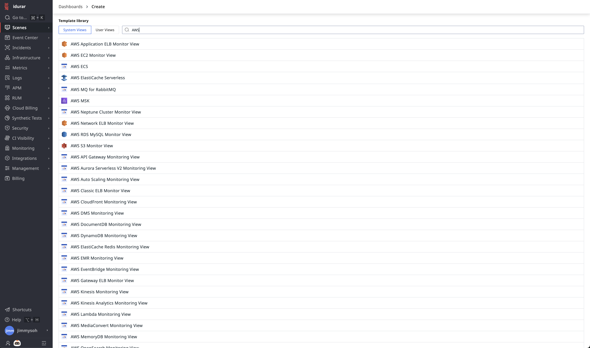
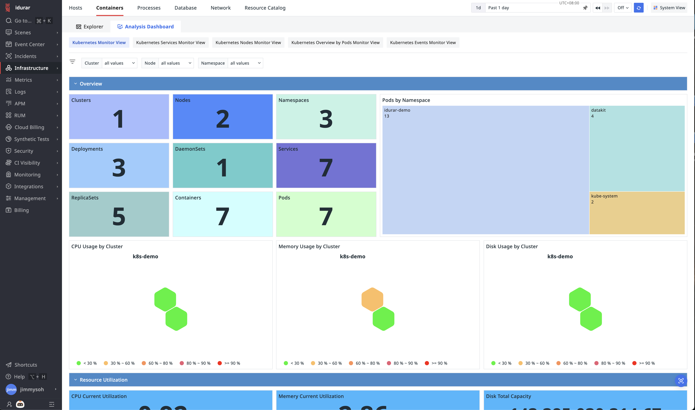
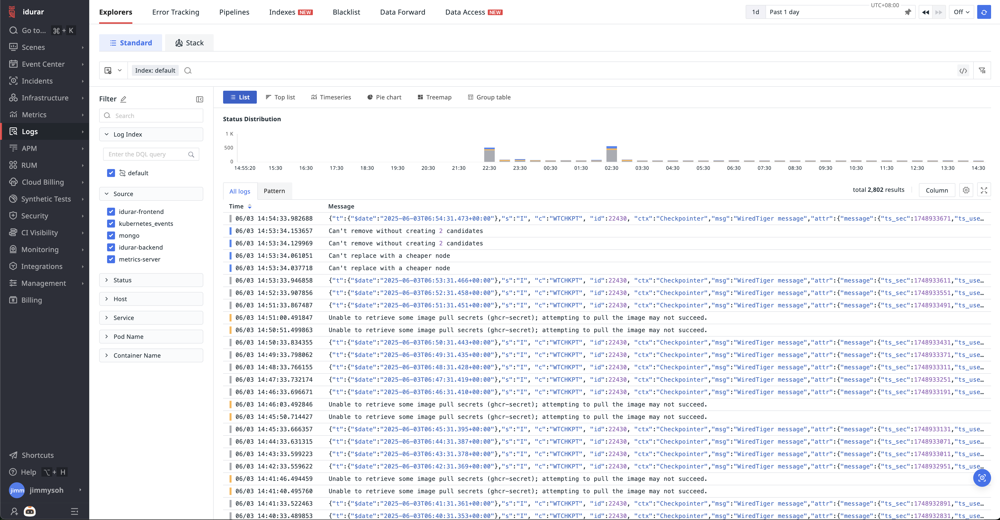
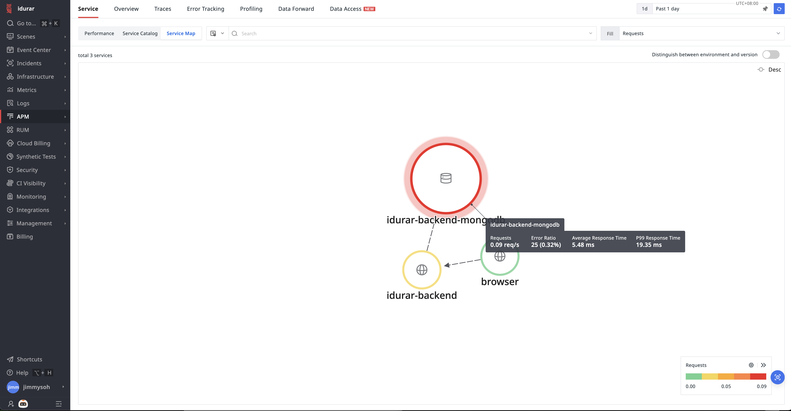
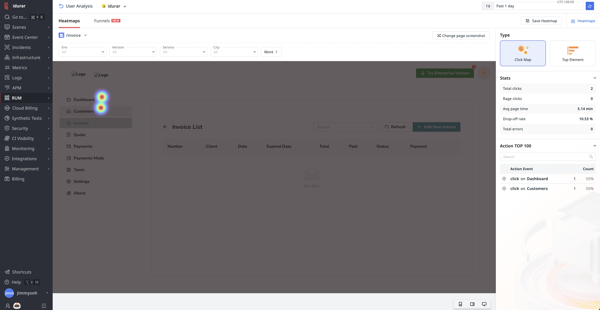
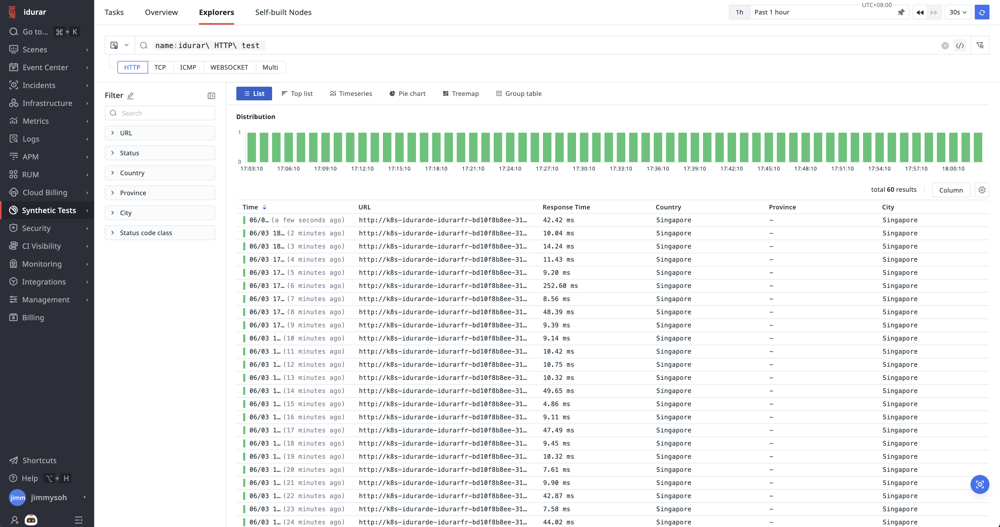
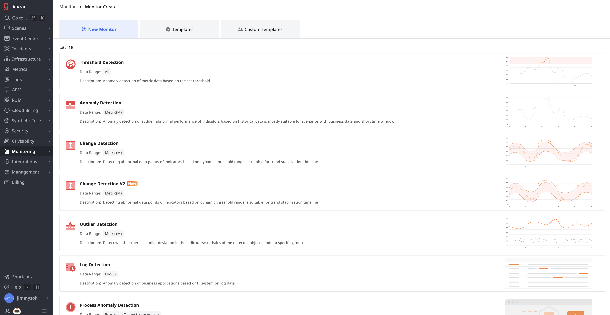
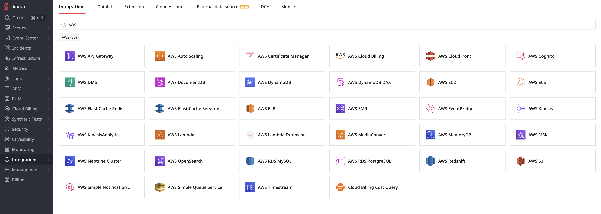
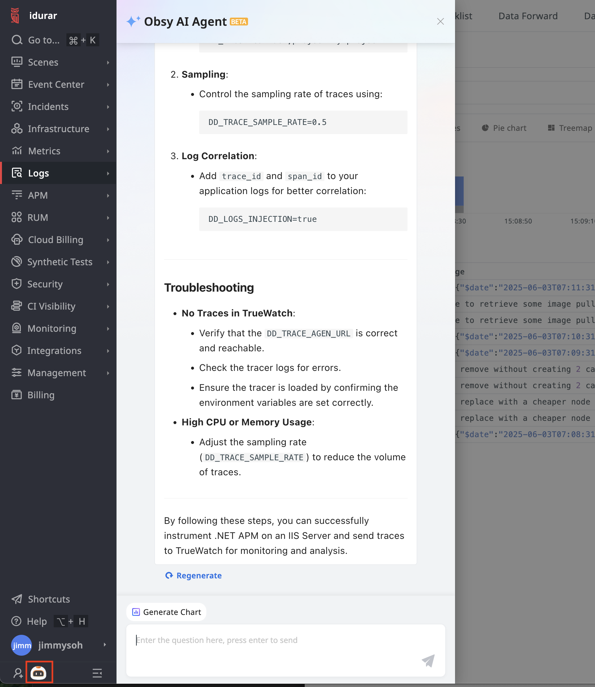

## TrueWatch Features Overview

### Interactive Dashboards

TrueWatch provides numerous out-of-the-box dashboards, enabling quick and straightforward analysis of observability data.

### Unified Infrastructure Monitoring

Easily integrate and monitor your entire infrastructure. Gain clear visibility into performance and effortlessly correlate components across your stack.

### Comprehensive Centralized Log Management

Efficiently ingest and manage logs centrally, supporting both edge and central processing. Utilize tags and text similarity to aggregate logs for business analytics, security investigations, and root cause analysis.

### End-to-End Tracing

Leverage complete tracing capabilities from client-side applications to backend services, enabling rapid identification and resolution of issues from a user's perspective.

### Real-Time User Experience Insights

Gain valuable insights into web and mobile user experiences through features such as user session replay and heatmap analysis, helping you understand actual user behaviors.

### Synthetic Tests

Ensure service availability with synthetic monitoring probes distributed globally, enabling quick detection and management of availability issues.

### Customized Monitoring with Advanced Alerting

Quickly set up robust monitoring systems with diverse monitoring rules and pre-configured templates. TrueWatch supports alert aggregation, silencing, and routing for efficient incident management.

### Extensive Integrations

Seamlessly integrate TrueWatch with Automata and external data sources. Automate inspections, generate reports, and implement advanced customizations tailored to your business scenarios.

### Observability AI Agent

Utilizing advanced LLM technology, TrueWatch's Observability AI Agent provides continuous technical support, assisting in feature usage and conducting root cause analysis based on existing data.

