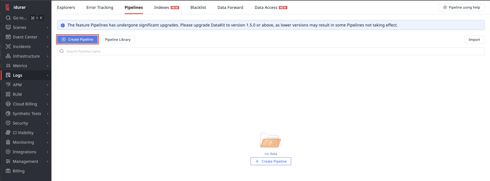
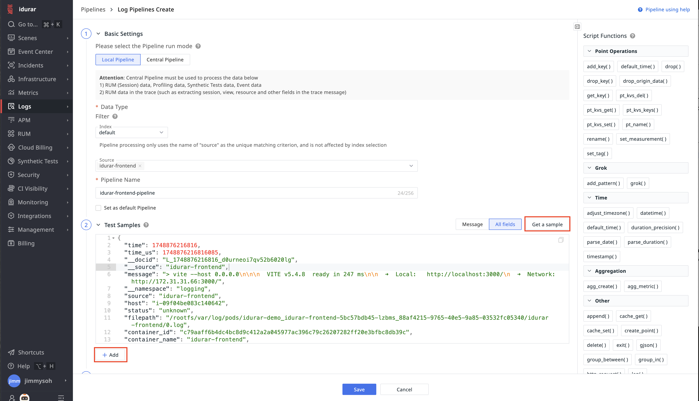
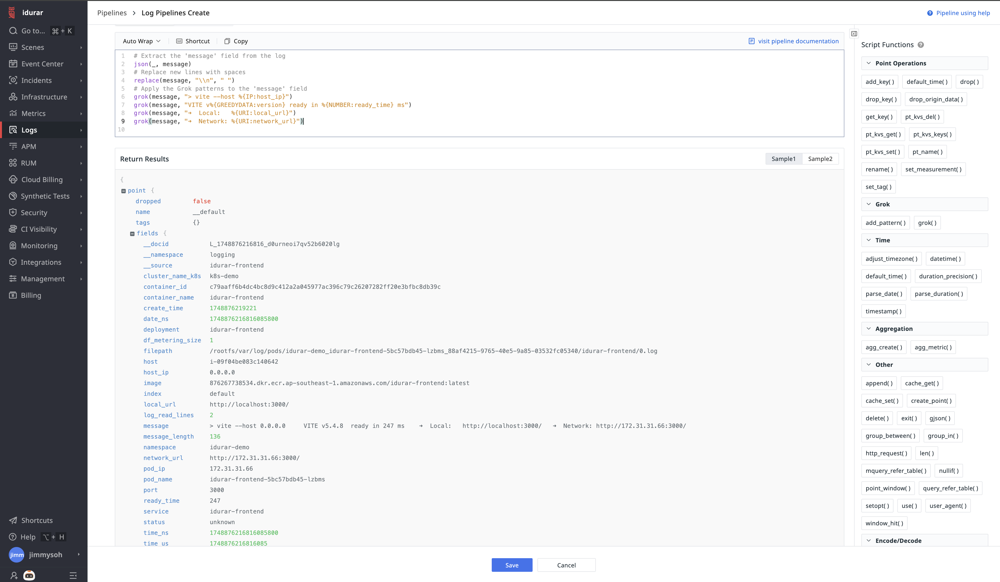

## 建立日誌管道

TrueWatch 支援在 Datakit 端（本地端）或平台中央端使用管道腳本處理觀測資料。本範例將說明如何使用 Grok 從自定義日誌訊息欄位提取資料。

### 步驟一：建立新的管道

前往 **Logs → Pipelines**，點擊 **Create Pipeline**。



### 步驟二：取得範例日誌

依照下圖填寫管道資訊，並點擊 **Get a Sample**。  
若未立即看到日誌，可點擊 **+Add** 從 `idurar-frontend` 來源取得更多日誌樣本。



### 步驟三：使用 Grok 定義解析規則

日誌的 `message` 欄位包含自訂訊息。請將以下管道腳本貼入 **Define Parsing Rules** 欄位並點擊 **Test**：

```
# Extract the 'message' field from the log
json(_, message)
# Replace new lines with spaces
replace(message, "\\n", " ")
# Apply the Grok patterns to the 'message' field
grok(message, "> vite --host %{IP:host_ip}")
grok(message, "VITE v%{GREEDYDATA:version} ready in %{NUMBER:ready_time} ms")
grok(message, "➜  Local:   %{URI:local_url}")
grok(message, "➜  Network: %{URI:network_url}")
```

### 步驟四：驗證並儲存管道設定

在 Return Results 中確認解析結果。完成後點擊 Save。
未來相同格式的日誌將會自動依照此設定解析。

