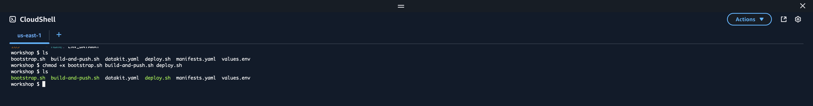
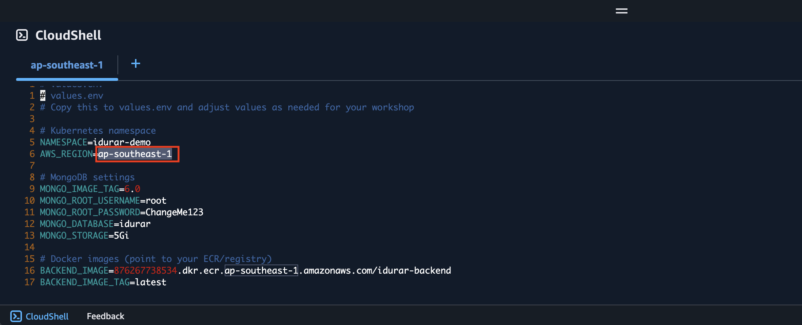
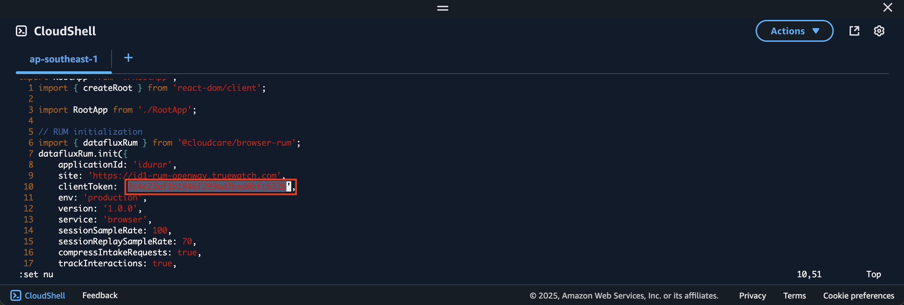
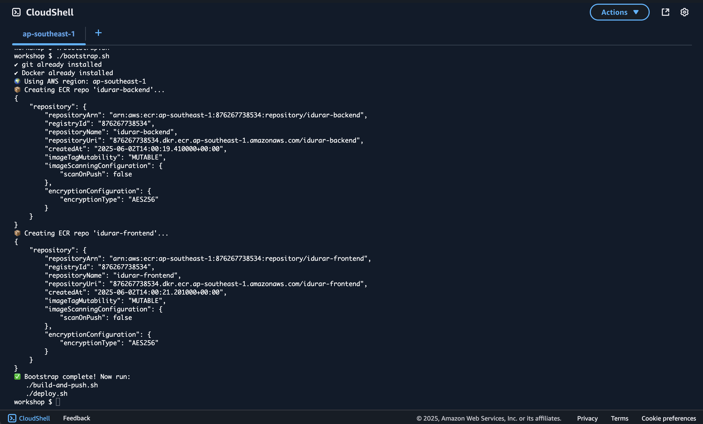
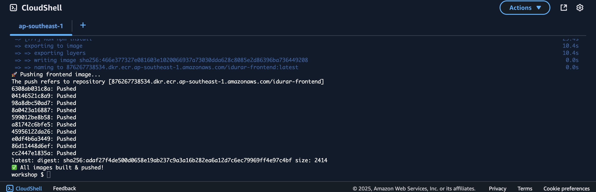
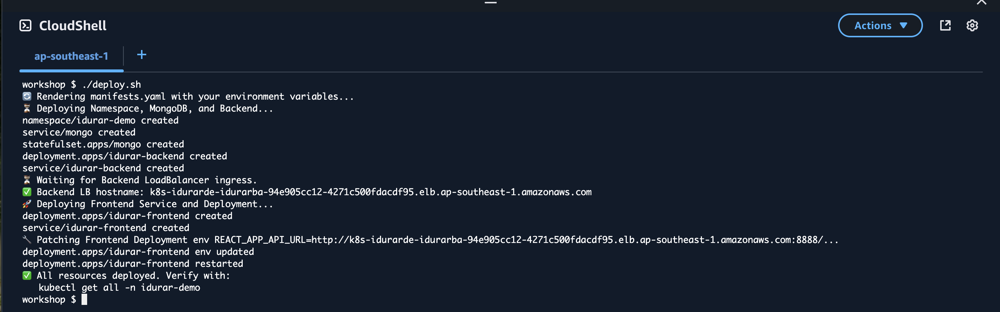
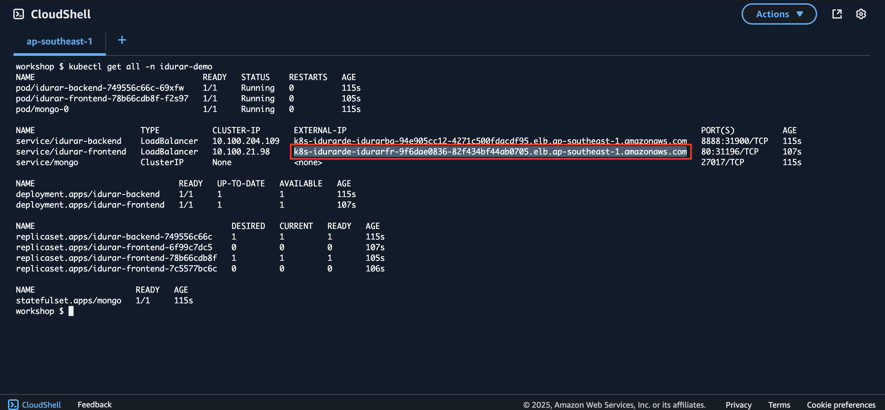
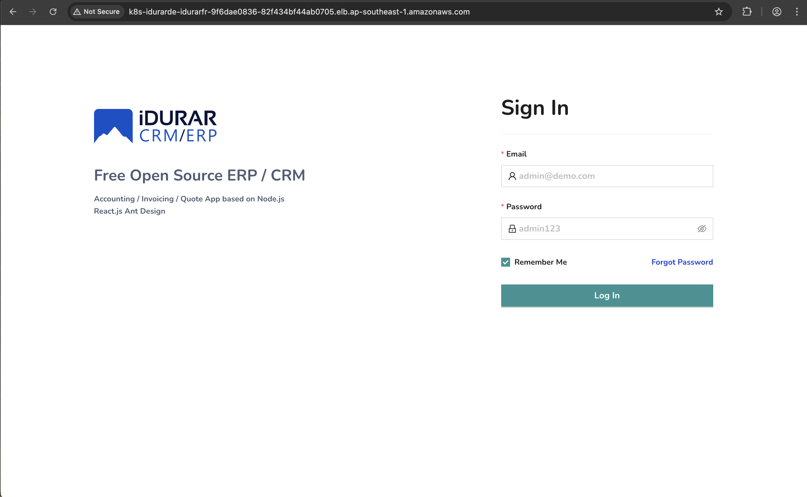

## Deploying the Demo Application

Follow these steps to deploy the demo application on AWS EKS:

### Step 1: Enable Script Execution

Ensure the deployment scripts are executable:

```
chmod +x bootstrap.sh build-and-push.sh deploy.sh
```



### Step 2: Verify AWS Region

Check and update the AWS region (line 6) in the values.env file (if required, to your AWS region):

```
vim values.env
```



### Step 3: Update RUM Client Token

Edit the RUM client token in the frontend configuration file:

```
vim ../frontend/src/main.jsx
```

Replace the clientToken on line 10 with the one obtained from TrueWatch → RUM → Application Settings:



### Step 4: Bootstrap Environment

Run the following command to set up the environment:

```
./bootstrap.sh
```


### Step 5: Build and Push to ECR

Build and push your application to Amazon ECR. This process may take up to 5 minutes:

```
./build-and-push.sh
```



### Step 6: Deploy Application and Datakit

Deploy your application and refresh Datakit deployment to apply new environment variables:

```
./deploy.sh

kubectl delete -f datakit.yaml && kubectl apply -f datakit.yaml
```



### Step 7: Obtain Application URL

Retrieve your application’s external URL by running:

```
kubectl get all -n idurar-demo
```



### Step 8: Access the Demo Application

Copy the external IP/URL from service/idurar-frontend and paste it into your browser. Use the following credentials to log in:

- Username: admin@demo.com
- Password: admin123



