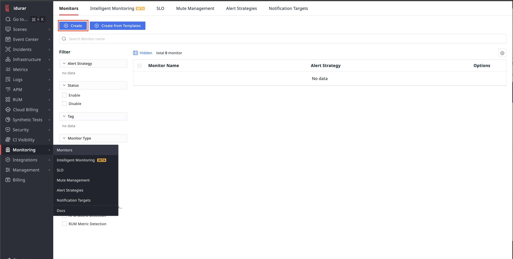
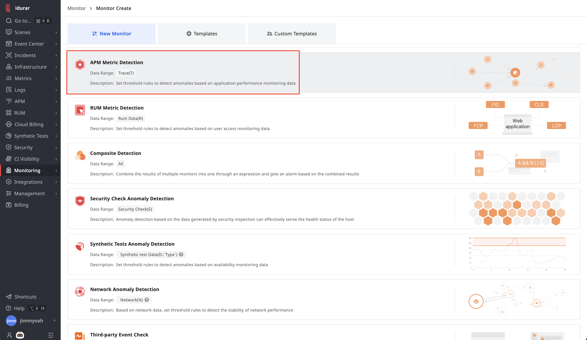
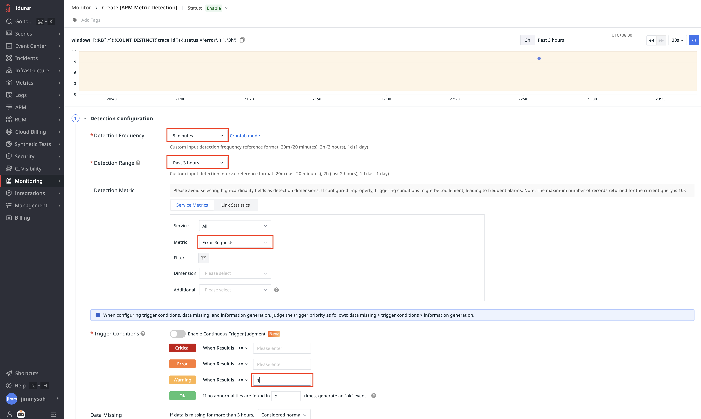
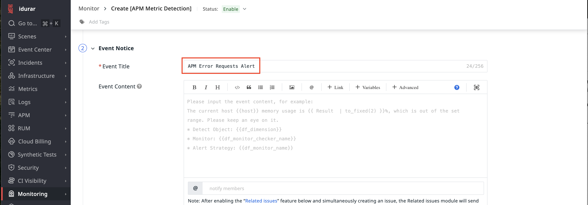

## Creating Alert Rules

TrueWatch allows you to configure diverse alerts for timely detection of anomalies. Follow these steps to set up an alert rule for detecting link anomalies:

### Step 1: Create a New Monitor

In the TrueWatch console, navigate to **Monitoring → Monitors** and click **Create**.

Select **APM Metric Detection**.

### Step 2: Configure Alert Parameters

Fill in the parameters as shown in the screenshots below, then click **Create**:

